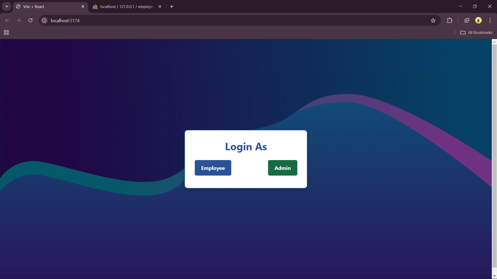
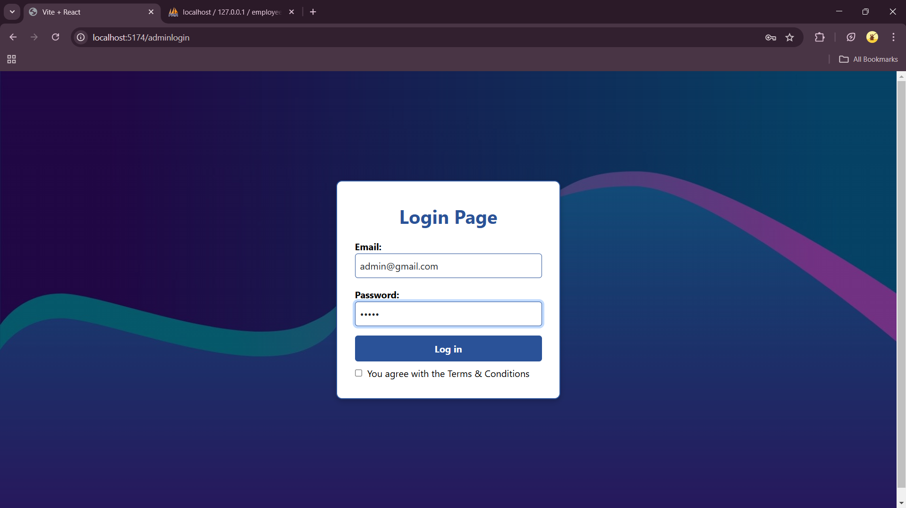
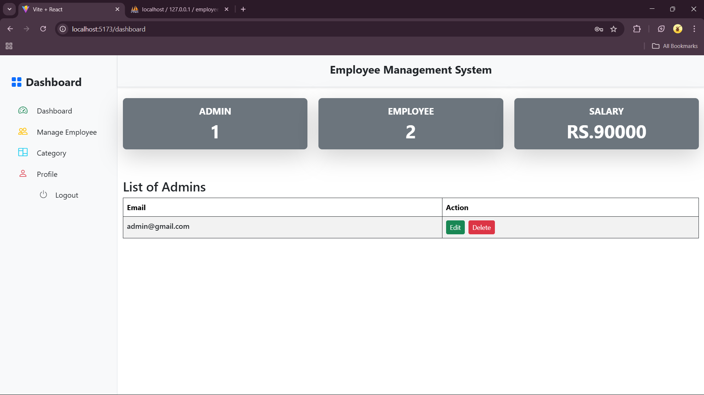
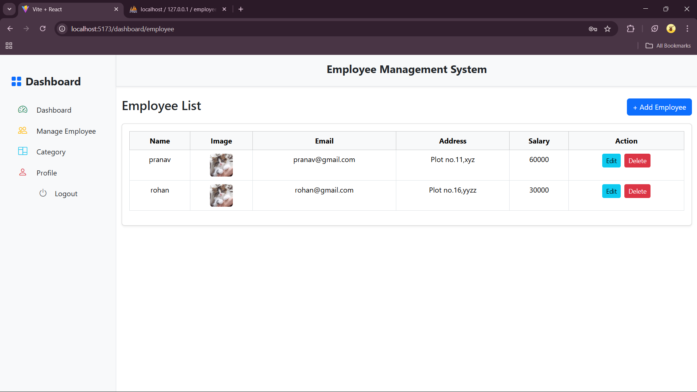
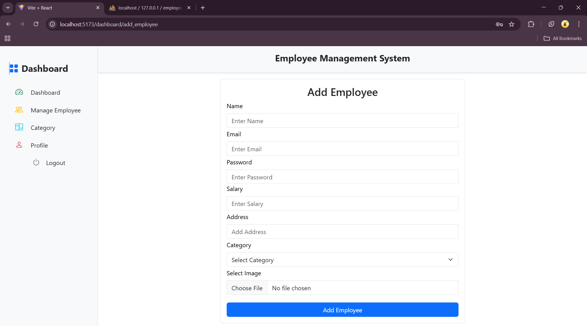
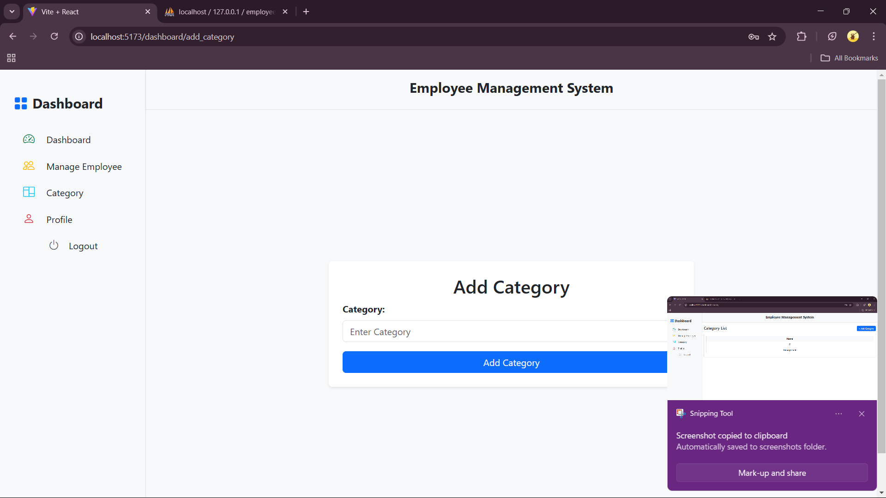
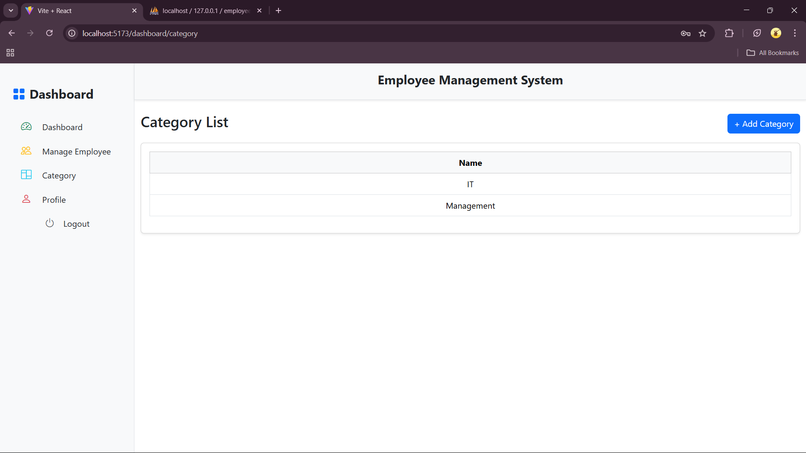
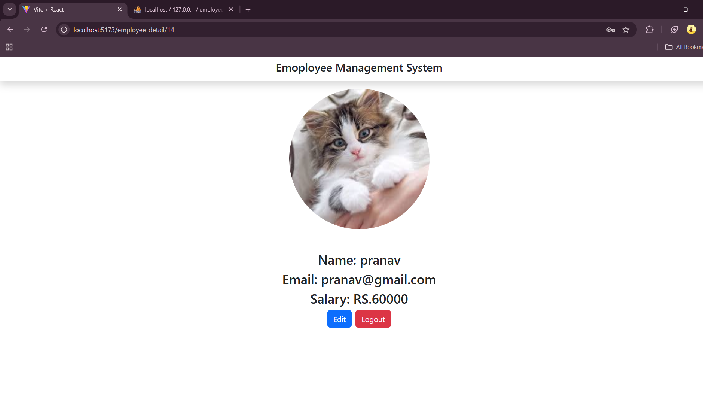
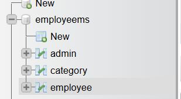

# Employee Management System

## Overview

The **Employee Management System (EMS)** is a web-based application built using **React (Vite)** for the frontend, **Node.js (Express.js)** for the backend, and **MySQL** (via **XAMPP** ) as the database. The system allows administrators to manage employees, categorize them, and track salary information.

## Project Structure

```
/EmployeeMS
│── /employeems    # Frontend (React + Vite)
│── /server        # Backend (Node.js + Express)/mysql

```
## Screenshots
### **1. Login**
 **login:**&#x20;




### **2. Dashboard**
 


### **3. Employee List**

 
  

  ### **5. Category**
  
  

### **4. Employee Profile**
  
  
---
## Features

- **Admin Dashboard**
  - View total admins, employees, and salaries.
  - Manage categories.
 
- **Employee Management**
  - List all employees.
  - View detailed employee profiles.
  - Update or delete employee information.
- **Authentication System**
  - Admin login with email and password.
  - Secure password storage.
- **MySQL Database Integration**
  - Tables for admin, categories, and employees.

## Technologies Used

### Frontend

- **React (Vite)**
- **Bootstrap** (for styling)


### Backend

- **Node.js (Express.js)**
- **Axios** (for API calls)
- **MySQL (via XAMPP)**


---

## Installation and Setup

### 1. Clone the Repository

```sh
npm install # to install dependencies
```

### 2. Frontend Setup (React + Vite)

```sh
cd employeems

npm run dev   # Start the frontend (Runs on Vite default port)
```

### 3. Backend Setup (Node.js + Express)

```sh
cd server
npm install   # Install backend dependencies
npm start     # Start the server
```

### 4. Database Setup (MySQL + XAMPP)

1. Open **XAMPP Control Panel** and start **Apache** & **MySQL**.
2. Open ** Workbench** and create a database:
   ```sql
   CREATE DATABASE employeems;
   ```
3. Create required tables:
   ```sql
   CREATE TABLE admin (
       id INT AUTO_INCREMENT PRIMARY KEY,
       email VARCHAR(255) NOT NULL,
       password VARCHAR(255) NOT NULL
   );

   CREATE TABLE category (
       id INT AUTO_INCREMENT PRIMARY KEY,
       name VARCHAR(255) NOT NULL
   );

   CREATE TABLE employee (
       id INT AUTO_INCREMENT PRIMARY KEY,
       name VARCHAR(255) NOT NULL,
       email VARCHAR(255) NOT NULL,
       password VARCHAR(255) NOT NULL,
       salary DECIMAL(10,2) NOT NULL,
       image VARCHAR(255)
   );
   ```
4. Import **Database Structure Screenshot:**&#x20;
 


---


